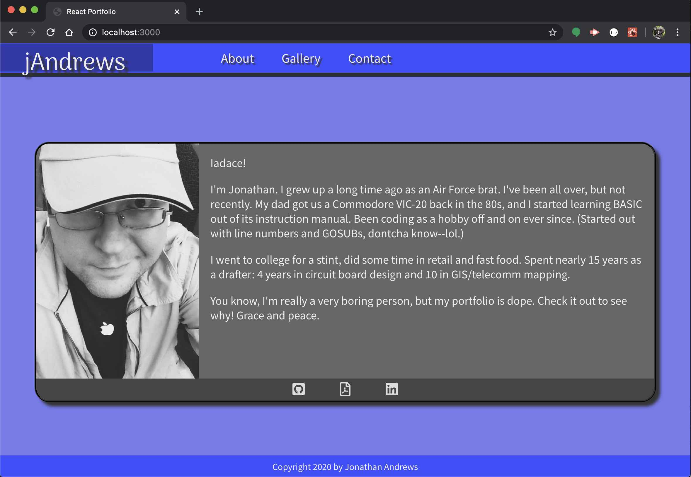
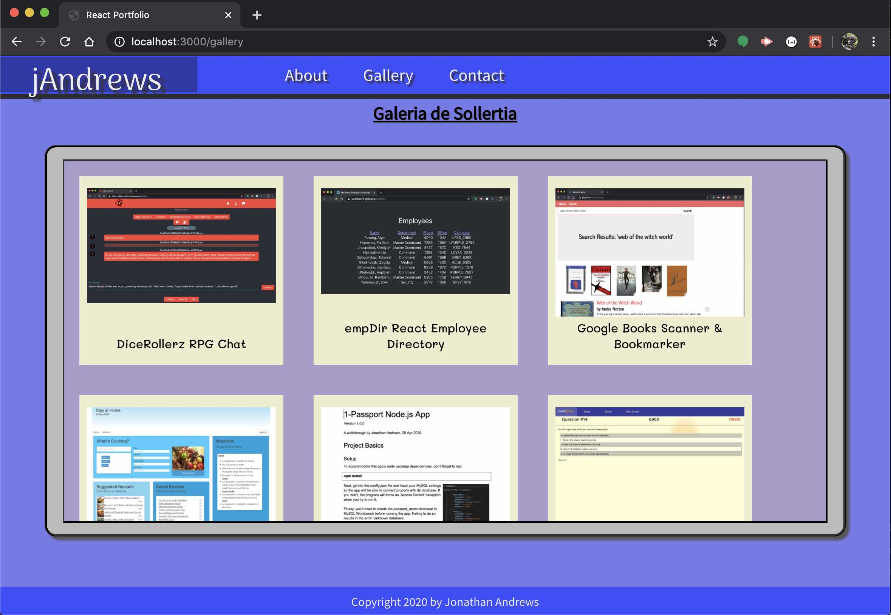
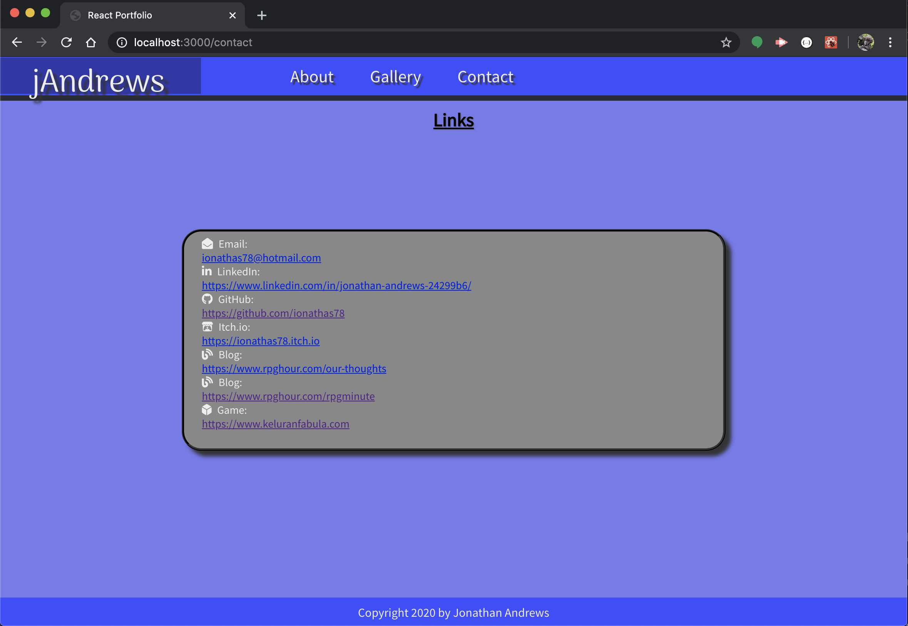

# reactPortfolio - 
[](https://opensource.org/licenses/MIT)

> Reactive Portfolio-ing

When we finished the React segment in class, I knew I had to have a portfolio
kitted out with React methodologies. The modular component aesthetic, the just-
in-time rendering processing, the next-generation ES6 programming principles.
It was all tres chic, and I wanted to show it off in my toolkit.


## User Story

```
AS A Web Developer 
I WANT to show off my React skills
SO THAT I can exhibit my work
```

```
GIVEN THAT I have a portfolio
WHEN I navigate through the links
THEN I find a single-page web app
WHEN I look at the page structure
THEN I find just-in-time React rendering
WHEN I look at the program structure
THEN I find discrete React components
```
            


## Graphic


## Table of Contents
* [Technologies](#Technologies)
* [Getting Started](#Getting)
* [Usage](#Usage)
* [Project Status](#Project)
* [Frequently Asked Questions](#FAQ)
* [Questions](#Additional)
* [Contributing](#Contributing)
* [License](#License)
## Technologies
Node.js\
React\
react-router-dom

## Getting Started
```
npm install
```
This is a react app, so it keeps the source files in the ./src folder and creates an optimized app folder in the ./build directory.
If you want to build the app for deployment, use the following script:
```
npm run deploy
```


## Usage
```
npm start
```
Running this app locally starts up a server on localhost:3000, which you can hit directly for the main (AboutMe) page. The links in the Galleria page are external, so you won't be able to navigate them without an active web connection.




## Project Status
Current


## Additional Questions
Email or DM me.

## Contributing
Contact us for guidelines on submitting contributions.

## License
This project is licensed under the The MIT License.


### ionathas78

This file generated on 5/31/2020 by goodReadMeGenerator, copyright 2020 Jonathan Andrews

